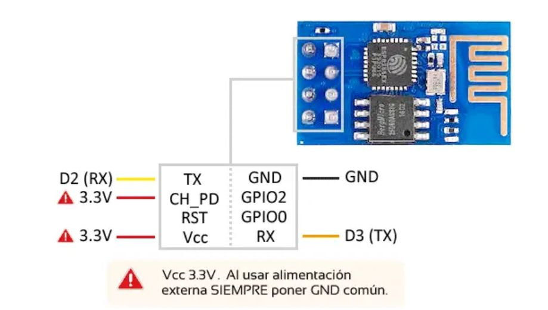

# 2smx-m12-arduino-esp8266

Codi i instruccions per a configurar un micrhochip ESP8266 per a fer-lo servir des d'un Arduino UNO per a tenir accés a Internet.

## Preparació de ESP8266

Per gravar el firmware fem servir [esptool](https://github.com/espressif/esptool).

El firmware que s'ha posat és la versió [1.7.4.0](AT_Firmware_bin_1.7.4.0/). S'hauria de provar si funciona amb una versió posterior.

Les instruccions per gravar-ho són:

    python esptool/esptool.py --port /dev/ttyUSB0 write_flash --flash_size 1MB 0x00000 ./AT_Firmware_bin_1.7.4.0/boot_v1.7.bin
    python esptool/esptool.py --port /dev/ttyUSB0 write_flash --flash_size 1MB 0x01000 ./AT_Firmware_bin_1.7.4.0/user1.1024.new.2.bin
    python esptool/esptool.py --port /dev/ttyUSB0 write_flash --flash_size 1MB 0xfc000 ./AT_Firmware_bin_1.7.4.0/esp_init_data_default_v08.bin
    python esptool/esptool.py --port /dev/ttyUSB0 write_flash --flash_size 1MB 0x7e000 ./AT_Firmware_bin_1.7.4.0/blank.bin
    python esptool/esptool.py --port /dev/ttyUSB0 write_flash --flash_size 1MB 0xfe000 ./AT_Firmware_bin_1.7.4.0/blank.bin

## Connexió de ESP8266 amb Arduino UNO

He seguit aquesta guia de [Conectar Arduino por WiFi con el módulo ESP8266 ESP01](https://www.luisllamas.es/arduino-wifi-esp8266-esp01/).

Els pins s'han de connectar així:

I aquí es pot trobar el [codi de l'sketch](./UNO-ArduinoESPAT-Library/), que fa servir la llibreria [ArduinoESPAT](https://github.com/nyampass/ArduinoESPAT-Library).