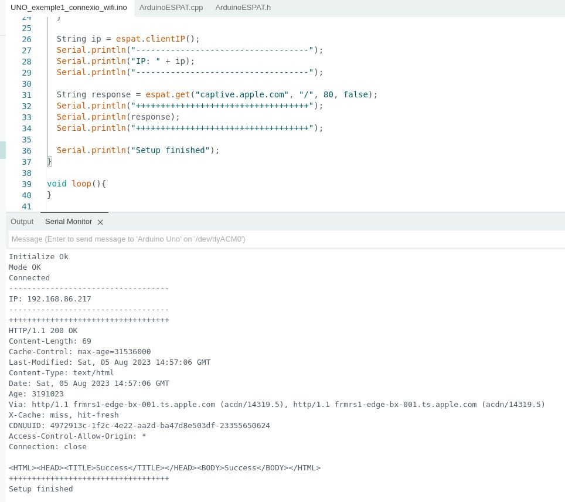

# 2smx-m12-arduino-esp8266

Codi i instruccions per a configurar un micrhochip ESP8266 per a fer-lo servir des d'un Arduino UNO per a tenir accés a Internet.

## Firmware de ESP8266

Per gravar el firmware fem servir [esptool](https://github.com/espressif/esptool):

    python3 -m venv .venv
    source .venv/bin/activate
    pip install -U esptool

Connectem el ESP8266 a l'adaptador USB tant xulo que ha fet en [Mikel](https://github.com/mlvillarroya):

Es important apretar el botón inferior quan connectem l'USB!

Primer de executem:

    esptool.py --port /dev/ttyUSB0 flash_id

La resposta que has d'obtenir a de ser similar a aquesta:

    esptool.py v4.6.2
    Serial port /dev/ttyUSB0
    Connecting....
    Detecting chip type... Unsupported detection protocol, switching and trying again...
    Connecting...
    Detecting chip type... ESP8266
    Chip is ESP8266EX
    Features: WiFi
    Crystal is 26MHz
    MAC: e8:db:84:e2:c5:d6
    Uploading stub...
    Running stub...
    Stub running...
    Manufacturer: d8
    Device: 4014
    Detected flash size: 1MB
    Hard resetting via RTS pin...

És important comprovar que `Detected flash size` és 1MB. Les adreces de memòria on gravar el firmware poden variar si és diferent.

Gravem aquest [firmware versió 1.7.4](firmware/AT_Firmware_bin_1.7.4.0/) amb les instruccions següents:

    esptool.py --port /dev/ttyUSB0 write_flash --flash_size 1MB 0x00000 ./firmware/AT_Firmware_bin_1.7.4.0/boot_v1.7.bin
    esptool.py --port /dev/ttyUSB0 write_flash --flash_size 1MB 0x01000 ./firmware/AT_Firmware_bin_1.7.4.0/user1.1024.new.2.bin
    esptool.py --port /dev/ttyUSB0 write_flash --flash_size 1MB 0xfc000 ./firmware/AT_Firmware_bin_1.7.4.0/esp_init_data_default_v08.bin
    esptool.py --port /dev/ttyUSB0 write_flash --flash_size 1MB 0x7e000 ./firmware/AT_Firmware_bin_1.7.4.0/blank.bin
    esptool.py --port /dev/ttyUSB0 write_flash --flash_size 1MB 0xfe000 ./firmware/AT_Firmware_bin_1.7.4.0/blank.bin

Per comprovar que tot funciona com s'espera, treu l'USB i torna'l a connectar, sense apretar el botó inferior, i obre l'Arduino IDE per a fer-lo servir per a connectar-te al port sèrie:

Envia l'ordre `AT` i has de rebre un `OK`, i l'ordre `AT+GMR` per a que mostri la versió de firmware. Important posar el baud correcte (115200) i l'opció de NL & CR.

## Connexió de ESP8266 amb Arduino UNO

He seguit aquesta guia de [Conectar Arduino por WiFi con el módulo ESP8266 ESP01](https://www.luisllamas.es/arduino-wifi-esp8266-esp01/).

Els pins del ESP8266 s'han de connectar així a l'Arduino UNO:

* TX => Serial 2
* RZ => Serial 3
* GND => GND
* CH_PD i Vcc => 3.3V

La foto següent mostra l'Arduino UNO i el ESP8266 conectats:

## Codi d'exemple

A la carpeta d'sketch hi ha el codi d'exemple. Es fa servir [ArduinoESPAT](https://github.com/nyampass/ArduinoESPAT-Library):

### Exemple 1 de connexió WIFI

Es connecta a la xarxa WIFI i mostra el contingut de la pàgina http://captive.apple.com/.

